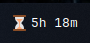
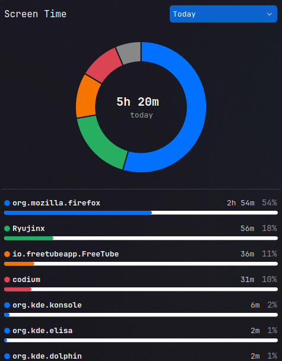
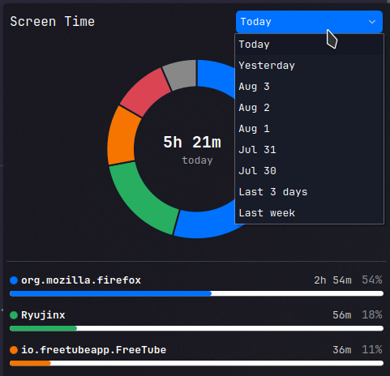

# Screen Time Tracking Tool

A simple screen time tracking tool. Only works for KDE. Includes a list of all the apps you spent time on, a donut pie chart for comparison and total time. You can filter for screen time for the past 7 days.

## Installing

Install script available just run:
```
git clone https://github.com/abdulMueedWaheed/timetracker
cd timetracker
chmod +x install.sh
./install.sh
```

## Uninstalling

- Keep your data (SQlite DB):
```
chmod +x uninstall.sh
./uninstall.sh
```

- No need to keep your data:
```
chmod +x uninstall.sh
./uninstall.sh --purge-data
```

## Usage
After installing, you can add it to the desktop or panel:

The compact Representation looks like this (in the panel): 

Full Representation (on desktop or on panel when clicked): 

Filtering (click on top right corner):



Hope you enjoy.